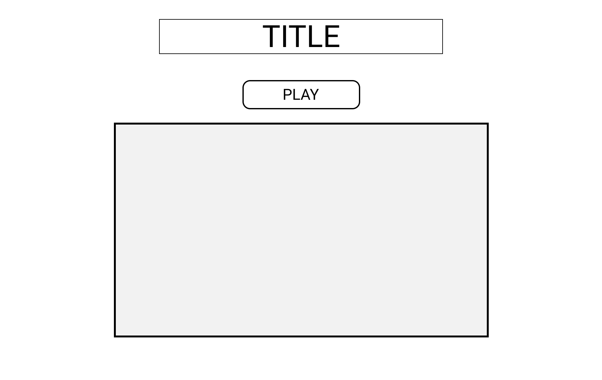
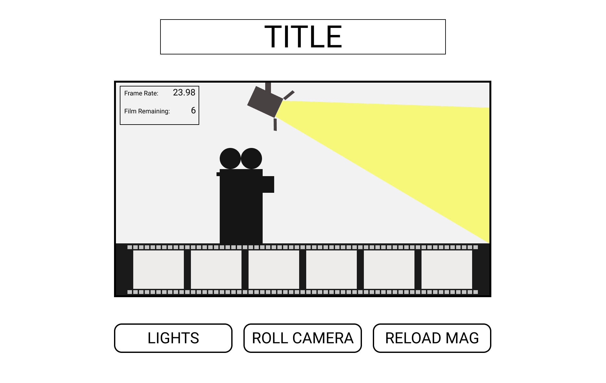

# Table of Contents

- [Game Description](#martini-shot)
- [User Stories](#user-stories)
- [Wireframes](#Wireframes)

# Martini Shot

In **Martini Shot**, you play as a film crew working to keep the movie alive.

Play as multiple crew members:

- Camera Operator: (Roll Camera) Make sure the camera keeps rolling to catch all the action. The director wants this to be shot like a documentary, so you need to make sure that the camera is **always** rolling.
- Gaffer: (Lights!) We are shooting this movie in a studio with old cables so the electric current can be unreliable. Make sure the lights stay on, so that the camera can see what the director wants to record. You won't be able to reload film if the lights are off because you can't see!
- 2nd AC: (Reload Mag), Make sure the film in the camera doesn't run out. You're in charge of reloading film into the camera any time it gets low. Your game ends if you're out of film.

# User Stories

When the user lands on the page, they will be greeted by:

- The title of the game **Martini Shot**
- An **Action!** button (Start Game)
- And an empty screen, resembling a movie screen.

Once the user clicks on the **Action!** button, the screen will smoothly rise and cover the area where the button used to be (the title will stay where it is) and three buttons will appear under the screen.

These buttons are:

## - Lights

The user will interact with the **Lights** button whenever the movie's lights turn off.

If the lights are off, the user will not be able to **Reload Mag**. But the user is expected to keep the camera rolling by interacting with **Roll Camera** at all times, including when the lights are off.

## - Roll Camera

The user will interact with the **Roll Camera** button at all times. Though they will have to deal with the other two tasks, they are always expected to roll the camera before, during, and after any distractions.

There will be a camera roll status bar that starts at **23.98** and will count down rapidly whenever the user isn't interacting with the button. The user loses if the status bar reaches 0.

## - Reload Mag

The user will interact with the **Reload Mag** button whenever the film strip at the bottom of the screen reaches 2 frames or less.

If the lights are off, the user will be unable to reload the mag, but the film strip will count down at twice the speed that it normally would.

The user loses if the frames get to 0.

## User Loses

If the user loses in any of the ways that will trigger a loss. A 'game over' note will appear on screen. The 3 buttons will disappear and a **Try Again** button will appear.

If the player interacts with the **Try Again** button, it will reset the game.

## Win Condition

The user wins the game if they can keep the shoot up and running for 45 seconds.

Once the user wins, a 'congratulations' note will appear and the screen will smoothly lower and reveal the **Action!** button, so the user can play again.

# Wireframes

## Landing Page

The user is greeted with a landing page consisting of the the title **Martini Shot** as well as a play button and a box resembling a screen.

_After testing, opted to have assets on screen in landing page_

## Play Page

After the user presses the play button, all the assets will appear inside the screen for the game to be able to begin

